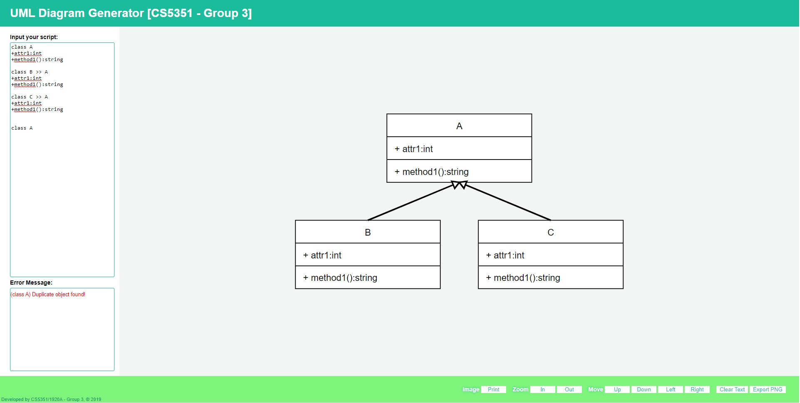
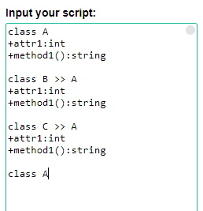
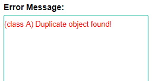
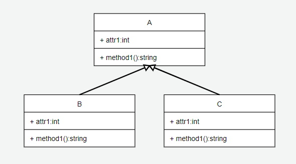

Usage Guide
===========

## Content

GENERAL INFORMATION
1. <a href="#sys-overview">System Overview</a>

SYSTEM SUMMARY
1.	<a href="#sys-config">System Configuration</a>
1.	<a href="#sys-data-flow">Data Flows</a>

USING the SYSTEM
1.	UML Diagram Generator
    1. <a href="#step-1">Input Text Script</a>
    1. <a href="#step-2">Generate Class Diagram</a>
    1. <a href="#step-3">Display Error Message</a>
    1. <a href="#step-4">Reset Input Text</a>
1. Diagram Viewer
    1.	<a href="#zoom">Zoom In / Out Diagram</a>
    1.	<a href="#move">Move Diagram</a>
    1.	<a href="#export">Export Diagram (Pending)</a>

Appendix
1. <a href="#screen-1">Home Screen</a>
1. <a href="#screen-2">Input Text Script</a>
1. <a href="#screen-3">Display Error Message</a>
1. <a href="#screen-4">Display Class Diagram</a>
1. <a href="#screen-5">Viewer Function</a>

# GENERAL INFORMATION

## System Overview

Online UML Class Diagram Drawing Tool: 

* A web-based tool written in HTML, CSS and JavaScript.
* Generate Class Diagram based on the input text captured.
*	System category:
    - <i>Text Parsing</i>: parses and validates the input text captured and constructs object(s)
    - <i>Diagram Visualization</i>: generates diagram bases on the object(s) created by text parser

# SYSTEM SUMMARY

## System Configuration

The online drawing tool is a client-scripting program (HTML, CSS, JavaScript). It can run on any web browser.

## Data Flows

Users input text in the designated textbox on the html page. On every key press, the keypress event will be fired. The input text will be sent to the text parser module. The parser will parse and validate the input text line by line. Object(s) will be constructed. The created object(s) will be passed to the drawer module. The drawer will use a tree structure to layout the graph and display the resultant Class Diagram.

# USING the SYSTEM

## UML Diagram Generator

### Input Text Script

1.	The textbox accepts input text of multiple lines. 
1.	The first line is the definition of an object.
    > e.g. Class A or Interface B 
1.	The object can either inherit a class or implement an interface. The system uses `>>` to denote inheritance and `||` to denote association. A class can have `0` or `1` superclass and it can implement `0` to `N` interface(s). An interface can implement `0` to `1` interface.
    > e.g. `class A >> B` or `class A || B || C` or `interface A || B`
1.	The second lines onwards define (a) the attributes and methods of a class, or (b) the methods of an interface.
1.	If the line defines an attribute, the text format should be: `<m><attribute_name>:<type>`. 

    `<m>` = modifier of the attribute. Values include:

    |||
    |---|---------|
    |`+`|public
    |`-`|private
    |`#`|protected
    |`~`|pakage

    `<attribute_name>` = attribtue name

    `<type>` = attribute type

    > e.g. a public attribute `attr1` that has type of `int` should be written as `+attr1:int`.

1. If the line defines a method, the text format should be:
`<m><method_name>(<mtype0 mattr0>[, <mtype1 mattr1>, ...]):<type>`.

    `<m>` = modifier of the attribute. Values include:

    |||
    |---|---------|
    |`+`|public
    |`-`|private
    |`#`|protected
    |`~`|pakage

    `method_name` = name of the method

    `<mtype0 mattr0>` = a parameter expression, type name `mtype0` and parameter name `mattr0`

    `[, <mtype1 mattr1>, ...]` = the parameter expressions can be optionally added and a separatator '`,`' should be used to divide each parameter.

1. The textbox accepts definition of multiple objects. If an object inherits a class or implements an interface, the referenced object must have already been defined in previous lines. Object name cannot be reused in the input text, in other words, duplication is not allowed.

### Generate Class Diagram

A tree structure graph is generated according to the input text.

### Display Error Message

When an error is found for an object during validation, an error message will be displayed in the error message box. Error messages for multiple objects will be displayed in the same error message box.

### Reset Input Text

1. The user can click  to clear the input text.

## Diagram Viewer

### Zoom In / Out Diagram

1. After a diagram is generated, the user can click  or  to zoom in or zoom out to view the diagram.

1. The user can also use their mouse wheel to control the zoom level of the diagram.

### Move Diagram

1. After a diagram is generated, the user can click  to position the diagram on display area.

1. The user can also drag on the diagram to reposition it.

### Export Diagram (Pending)

1. After a diagram is generated, the user can click  export the diagram to an image.

# Appendix

## Home Screen

## Input Text Script

## Display Error Message

## Display Class Diagram

## Viewer Function

